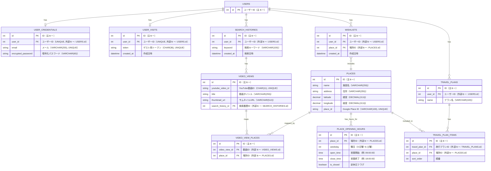

# 🎥VLOMAPLAN🗺️
『VLOMAPLAN』はVlogを観ながら旅行で行きたい場所を整理・プラン化できるWEBアプリです。

「Vlog視聴・場所検索・リスト作成・プラン化」をほぼ一画面で完結するようになっています！

基本機能はログイン無しで使用可能です！お気軽にお試しください。
> 未ログイン時のデータ保存は**7日間**、会員登録すると**無期限**で保存されます。未ログイン時に作成したデータは**登録時に引き継ぎ**可能です。

URL:https://app.vlomaplan.com/

**トップページ**
ここにスクリーンショットを載せる

## 使用した技術

- フロントエンド
  - HTML / CSS 
  - JavaScript（React 19, Vite）
  - React Router（ルーティング）
  - @vis.gl/react-google-maps（地図表示）
  - Google Maps JavaScript API（Places API *New* / Autocomplete）
  - react-modal-sheet（モバイル向けボトムシートUI）
  - ESLint / Prettier（コード整形・静的解析）

- バックエンド
  - Ruby 3.2.8
  - Ruby on Rails 7.1.5（APIモード）
  - RSpec（テスト）
  - RuboCop（コード解析）
  - bcrypt（パスワードハッシュ）

- データベース
  - MySQL 8.4

- 外部API・サービス連携
  - YouTube Data API v3（動画検索・視聴履歴の取り扱い）
  - Google Maps Platform（Maps JS / Places API *New* / Autocomplete）

- インフラ・開発環境
  - Docker / Docker Compose
  - AWS（ECR, ECS Fargate, VPC, ALB, RDS, S3, CloudFront, Route53, ACM, Systems Manager Parameter Store）
  - シークレット管理：AWS SSM Parameter Store
  - バージョン管理／開発フロー：GitHub（main／develop運用・PRレビュー）

## ER図

## AWS構成図

## 実装機能一覧
- 基本機能
  - 新規会員登録・ログイン機能
  - YouTubeのVlog動画検索・視聴機能
  - GoogleMapでの場所検索機能
  - 行きたい場所リストへの登録・削除
  - 旅行プランの作成・編集・削除
  - 旅行プランの並べ替え機能
  - モーダルでのマップの開閉機能(画面幅が狭い時)

### データ保存について

- ゲスト利用（ログインなし）
  - 作成した「行きたい場所」「旅行プラン」は**7日間**保存されます（期限を過ぎると自動削除）。
- 会員登録／ログイン後
  - データはサーバーに**無期限保存**され、**複数端末で同期**されます。
- 引き継ぎ
  - ゲストで作成したデータは、**会員登録またはログイン時にそのまま引き継がれます**。
