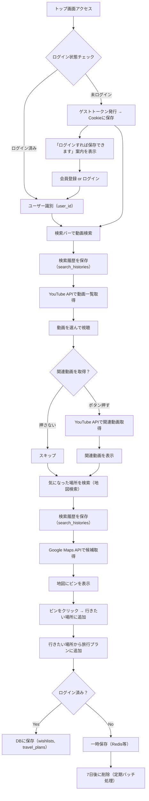
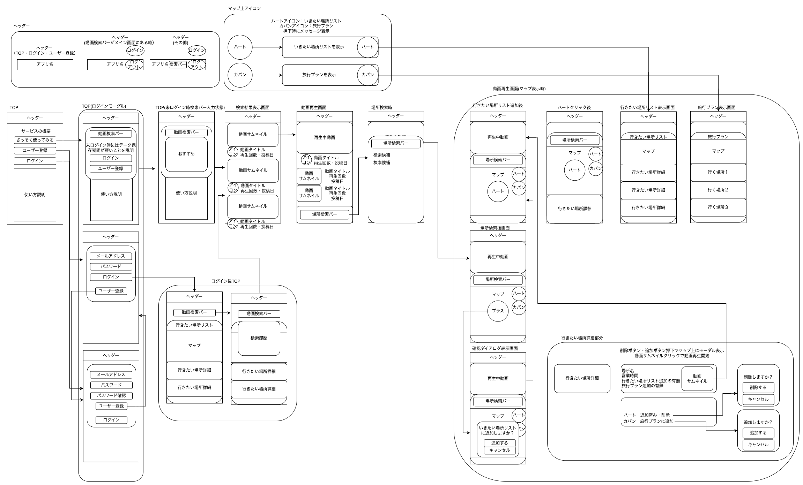
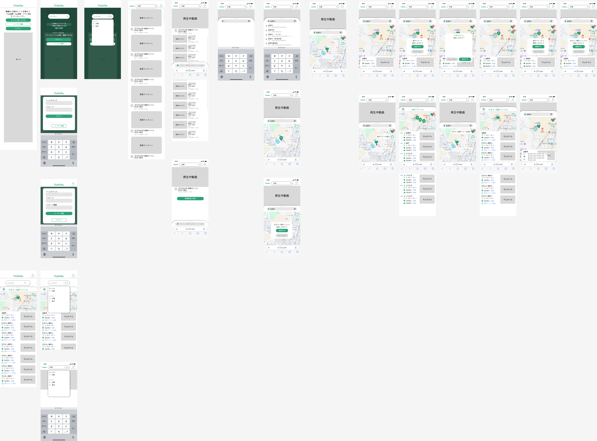
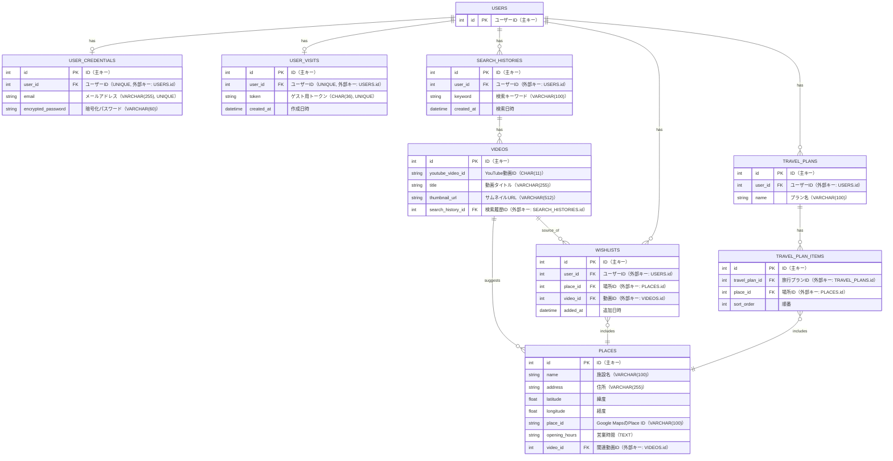
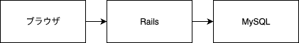

## 業務フロー

```mermaid
graph TD
  A[トップ画面アクセス] --> B{ログイン状態チェック}
  B -- ログイン済み --> C[ユーザー識別（user_id）]
  B -- 未ログイン --> D[ゲストトークン発行 → Cookieに保存]
  C --> E[検索バーで動画検索]
  D --> E
  %% 動画検索の検索履歴を保存
  E --> F[検索履歴を保存（search_histories）]
  F --> G[YouTube APIで動画一覧取得]
  G --> H[動画を選んで視聴]
  H --> I{関連動画を取得？}
  I -- ボタン押す --> J[YouTube APIで関連動画取得]
  I -- 押さない --> K[スキップ]
  J --> L[関連動画を表示]
  K --> M
  L --> M[気になった場所を検索（地図検索）]
  %% 地図検索の検索履歴を保存
  M --> N[検索履歴を保存（search_histories）]
  N --> O[Google Maps APIで候補取得]
  O --> P[地図にピンを表示]
  P --> Q[ピンをクリック → 行きたい場所に追加]
  Q --> R[行きたい場所から旅行プランに追加]
  R --> S{ログイン済み？}
  S -- Yes --> T[DBに保存（wishlists, travel_plans）]
  S -- No --> U[一時保存（Redis等）]
  U --> V[7日後に削除（定期バッチ処理）]

  %% ログイン誘導など
  D --> W[「ログインすれば保存できます」案内を表示]
  W --> X[会員登録 or ログイン]
  X --> C
```
## 画面遷移図

## ワイヤーフレーム

## ER図

```mermaid
erDiagram
  USERS {
    int id PK "ユーザーID（主キー）"
  }

  USER_CREDENTIALS {
    int id PK "ID（主キー）"
    int user_id FK "ユーザーID（UNIQUE, 外部キー: USERS.id）"
    string email "メールアドレス（VARCHAR(255), UNIQUE）"
    string encrypted_password "暗号化パスワード（VARCHAR(60)）"
  }

  USER_VISITS {
    int id PK "ID（主キー）"
    int user_id FK "ユーザーID（UNIQUE, 外部キー: USERS.id）"
    string token "ゲスト用トークン（CHAR(36), UNIQUE）"
    datetime created_at "作成日時"
  }

  SEARCH_HISTORIES {
    int id PK "ID（主キー）"
    int user_id FK "ユーザーID（外部キー: USERS.id）"
    string keyword "検索キーワード（VARCHAR(100)）"
    datetime created_at "検索日時"
  }

  VIDEOS {
    int id PK "ID（主キー）"
    string youtube_video_id "YouTube動画ID（CHAR(11)）"
    string title "動画タイトル（VARCHAR(255)）"
    string thumbnail_url "サムネイルURL（VARCHAR(512)）"
    int search_history_id FK "検索履歴ID（外部キー: SEARCH_HISTORIES.id）"
  }

  PLACES {
    int id PK "ID（主キー）"
    string name "施設名（VARCHAR(100)）"
    string address "住所（VARCHAR(255)）"
    float latitude "緯度"
    float longitude "経度"
    string place_id "Google MapsのPlace ID（VARCHAR(100)）"
    string opening_hours "営業時間（TEXT）"
    int video_id FK "関連動画ID（外部キー: VIDEOS.id）"
  }

  WISHLISTS {
    int id PK "ID（主キー）"
    int user_id FK "ユーザーID（外部キー: USERS.id）"
    int place_id FK "場所ID（外部キー: PLACES.id）"
    int video_id FK "動画ID（外部キー: VIDEOS.id）"
    datetime added_at "追加日時"
  }

  TRAVEL_PLANS {
    int id PK "ID（主キー）"
    int user_id FK "ユーザーID（外部キー: USERS.id）"
    string name "プラン名（VARCHAR(100)）"
  }

  TRAVEL_PLAN_ITEMS {
    int id PK "ID（主キー）"
    int travel_plan_id FK "旅行プランID（外部キー: TRAVEL_PLANS.id）"
    int place_id FK "場所ID（外部キー: PLACES.id）"
    int sort_order "順番"
  }

  USERS ||--o| USER_CREDENTIALS : has
  USERS ||--o| USER_VISITS : has
  USERS ||--o{ SEARCH_HISTORIES : has
  USERS ||--o{ WISHLISTS : has
  USERS ||--o{ TRAVEL_PLANS : has

  SEARCH_HISTORIES ||--o{ VIDEOS : has
  VIDEOS ||--o{ PLACES : suggests
  VIDEOS ||--o{ WISHLISTS : source_of

  TRAVEL_PLANS ||--o{ TRAVEL_PLAN_ITEMS : has
  TRAVEL_PLAN_ITEMS }o--|| PLACES : includes
  WISHLISTS }o--|| PLACES : includes
```

### 制約
- WISHLISTS: `UNIQUE(user_id, place_id)` により、同じ場所を同じユーザーが複数登録できない

## システム構成図
