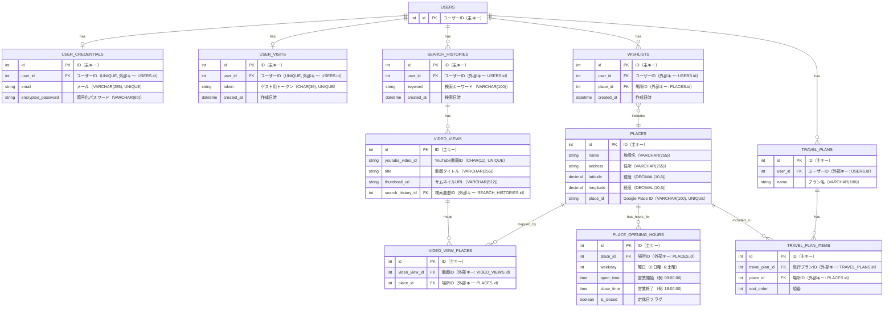

## 業務フロー

## 画面遷移図

## ワイヤーフレーム

## ER図

### 制約
- WISHLISTS: UNIQUE(user_id, place_id) / NOT NULL
- PLACE_OPENING_HOURS:
    - UNIQUE(place_id, weekday)
    - open_time / close_time: is_closed = true の場合のみ NULL 可
- VIDEO_VIEW_PLACES:
    - UNIQUE(video_view_id, place_id)
    - video_view_id / place_id: NOT NULL
- 全カラム NOT NULL
  - 例外:
    - PLACE_OPENING_HOURS.open_time / close_time（is_closed = true の場合のみ NULL 可）

## システム構成図
